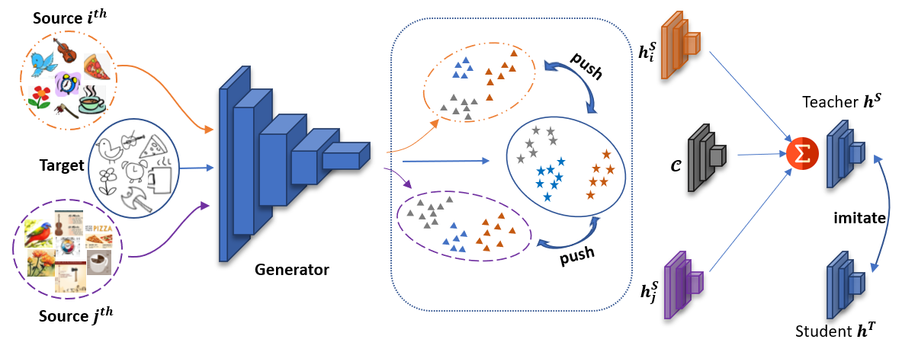

# STEM: An approach to Multi-source Domain Adaptation with Guarantees

<p align="center">
   
</p>

## Introduction
This is the implementation of ``STEM: An approach to Multi-source Domain Adaptation with Guarantees''

### Prerequisites
System Requirement:
* Ubuntu 16.04
* Anaconda3
* Cuda toolkit 10.0

Install other environment requirement by Anaconda3 following:
```
conda env create -f env.yml
```

**Note**: the environment requires `tensorbayes` libs, however, available tensorbayes using Python 2.7. To fix the problem, please download [tensorbayes](https://drive.google.com/file/d/1vjLciwJCW7kiiYARg7k5gpaPAAvdk130/view?usp=sharing), unzip it and overide it in `/path-to-conda/conda/envs/stem/lib/python3.6/site-packages`
### Dataset Preparation
Please download and unzip the dataset and save all `*.mat` file under `../datasets`. To save time computing, we extracted ResNet101 feature for Office-Caltech10 and provide them as following:

* [Digits-five]()
* [Office-31]()
* [DomainNet](http://ai.bu.edu/M3SDA/)

### Training
The config parameter to train model in `config` folder, please check it before run. To train the model, simply run:
```
python run_stem_ht_mimic_hs.py --config <target name>.yaml
```

For example: to train with target domain is Synthetic Digits 
```
python run_stem_ht_mimic_hs.py --config syn.yaml
```